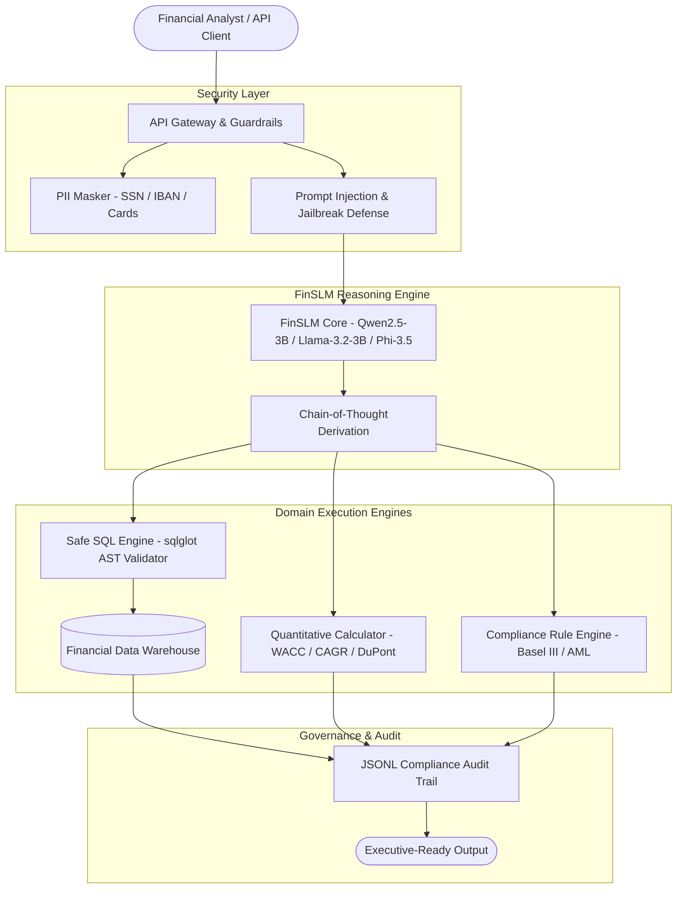

# 🏦 Financial Intelligence SLM Platform (FinSLM)

[](https://www.python.org/downloads/)
[](https://fastapi.tiangolo.com/)
[](https://pytorch.org/)
[](https://huggingface.co/)
[](https://docs.docker.com/compose/)
[](LICENSE)

> **Enterprise-Grade Financial Small Language Model (SLM) Platform** engineered for domain fine-tuning (**QLoRA 4-bit** on consumer GPUs like RTX 5070 8GB), high-assurance **Financial Text-to-SQL**, **SEC Filings QA**, **Quantitative Math Calculation**, **Market Sentiment Analysis**, and **Regulatory Compliance Auditing**.

---

## 🧭 Overview & Core Capabilities

The **FinSLM Platform** bridges the gap between massive general-purpose LLMs and lightweight, domain-specialized Small Language Models. It enables sub-second financial reasoning, automated schema-linked database querying, and rigorous audit logging under strict enterprise security policies.

### 5 Core Specialized Financial Domains

1. **🛡️ Text-to-SQL & Financial Warehouse Querying**: Safe NL-to-SQL generation with schema-linking, AST validation (`sqlglot`), and read-only execution guardrails.
2. **📄 SEC Filings & Tabular QA (10-K, 10-Q, 8-K)**: Item 1A (Risk Factors) and Item 7 (MD&A) extraction and tabular financial statement reasoning.
3. **🔢 Quantitative Financial Mathematics**: Step-by-step verified computation traces for WACC, DCF, 3-Stage DuPont ROE Decomposition, CAGR, and Liquidity ratios.
4. **📈 Market Sentiment & Earnings Intelligence**: Nuanced financial sentiment classification (`[BULLISH | NEUTRAL | BEARISH | MIXED]`) with catalyst and downside risk extraction.
5. **⚖️ Regulatory Risk & Compliance Auditing**: Rule checking against Basel III capital adequacy ratios, Dodd-Frank, and BSA/AML anti-structuring detection ($10,000 threshold).

---

## ⚙️ System Architecture



---

## 📁 Repository Structure

```
fin-intelligence-platform/
│
├── pyproject.toml               # Project metadata & build dependencies
├── requirements.txt             # Core Python & ML requirements
├── .env.example                 # Environment configuration template
├── README.md                    # Platform documentation & quickstart
│
├── data/
│   ├── raw/                     # Raw financial datasets
│   ├── processed/               # Curated ChatML training splits (train/val/test)
│   ├── synthetic/               # Generated synthetic reasoning pairs
│   └── financial_warehouse.db   # Seed SQLite warehouse (positions, income statements)
│
├── docker/
│   ├── Dockerfile               # Multi-stage CUDA production Dockerfile
│   └── docker-compose.yml       # Orchestration (API, PostgreSQL, Qdrant)
│
├── models/
│   ├── base/                    # Base SLM weights (Qwen2.5-3B, Llama-3.2-3B)
│   ├── adapters/                # Trained LoRA / QLoRA checkpoints
│   └── finetuned/               # Merged SafeTensors & GGUF exports
│
├── src/
│   ├── api/                     # FastAPI endpoints, routes, middleware
│   ├── core/                    # Domain schemas, ChatML prompts, audit logger
│   ├── data/                    # Dataset loaders, synthetic generators, curator
│   ├── training/                # QLoRA 4-bit trainer, inference engine, exporter
│   ├── sql/                     # sqlglot AST validator, safe DB executor
│   ├── analysis/                # WACC/CAGR calculator, SEC parser, compliance
│   ├── security/                # PII masker, prompt injection guardrails
│   ├── rag/                     # Hybrid Dense + BM25 retrieval engine
│   ├── config/                  # Pydantic v2 settings management
│   └── cli.py                   # Master Typer CLI (`fin-slm`)
│
├── tests/
│   └── unit/                    # 18 automated unit tests (SQL, PII, Math, API)
└── logs/                        # Daily JSONL compliance audit trails
```

---

## 🚀 Quickstart Guide

### 1. Setup Environment

```bash
# Create virtual environment with Python 3.11+
python -m venv .venv
source .venv/bin/activate    # Linux / macOS
# .venv\Scripts\activate     # Windows

# Install dependencies
pip install -r requirements.txt
cp .env.example .env
```

### 2. Run Test Suite

```bash
pytest -v
```

### 3. Generate Synthetic Training Data

```bash
python src/cli.py curate-data --num-sql 150 --num-math 150 --num-compliance 100
```

### 4. Train with QLoRA on Local GPU (8GB VRAM)

```bash
# Trains 4-bit QLoRA with paged_adamw_8bit & gradient checkpointing
python src/cli.py train --epochs 3 --batch-size 1 --lr 0.0002
```

### 5. Run CLI Financial Queries

```bash
# Text-to-SQL Query
python src/cli.py query "Find the top equity positions ordered by market value" --task text_to_sql

# Verified WACC Calculation
python src/cli.py calculate-wacc --equity 600000 --debt 400000 --cost-equity 0.10 --cost-debt 0.05 --tax-rate 0.21

# Safe SQL Execution
python src/cli.py sql-exec "SELECT ticker, market_value FROM portfolio_positions ORDER BY market_value DESC"
```

### 6. Launch Production REST API

```bash
python src/cli.py serve --host 0.0.0.0 --port 8000
```
Interactive Swagger Documentation: 👉 `http://localhost:8000/docs`

---

## 🔒 Security & Guardrails

- **Financial PII Masking**: Automatically sanitizes SSNs, credit cards, bank accounts, and IBANs before model generation and logging.
- **SQL AST Validation**: Inspects queries with `sqlglot`, blocking DDL/DML write operations (`DROP`, `DELETE`, `UPDATE`) and enforcing `LIMIT` caps.
- **Prompt Injection Defense**: Filters adversarial override attacks and jailbreak attempts.
- **Compliance Audit Trail**: Every transaction is logged with timestamps, latency, prompt tokens, and redacted inputs in `logs/audit_trail_YYYY-MM-DD.jsonl`.

---

## 🐳 Docker Deployment

```bash
cd docker
docker compose up -d --build
```

---

## 👤 Author
**Viraj Jadhao** — [GitHub](https://github.com/Viraj281105)
