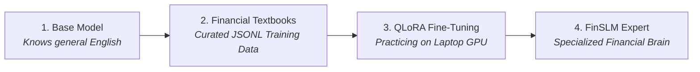

# 🏦 Vijay's Financial AI Workshop: Build Your Own Financial SLM

Welcome, Vijay! 👋 

This folder is your personal hands-on laboratory for building an **AI-powered Financial Intelligence System** from scratch. 

You don't need any prior background in Artificial Intelligence to follow this guide. Everything is explained step-by-step in plain English — covering **Why**, **What**, **When**, and **How**.

---

## 🧭 Table of Contents
1. [🧠 The Absolute Basics: What is AI and What is an SLM?](#-the-absolute-basics-what-is-ai-and-what-is-an-slm)
2. [🎯 Why Build a Financial SLM? (The 5 Superpowers)](#-why-build-a-financial-slm-the-5-superpowers)
3. [🧩 How an AI Actually Learns: The 4 Stages](#-how-an-ai-actually-learns-the-4-stages)
4. [📁 Tour of Your Workshop Files](#-tour-of-your-workshop-files)
5. [🚀 Step-by-Step Building Roadmap](#-step-by-step-building-roadmap)
   - [Step 1: Setting Up Your Environment](#step-1-setting-up-your-environment)
   - [Step 2: Teaching the AI How to Talk (Prompt Engineering)](#step-2-teaching-the-ai-how-to-talk-prompt-engineering)
   - [Step 3: Creating Training Data (The AI's Textbooks)](#step-3-creating-training-data-the-ais-textbooks)
   - [Step 4: Training the Model with QLoRA on Your GPU](#step-4-training-the-model-with-qlora-on-your-gpu)
   - [Step 5: Building Safe Financial Tools (SQL & Math)](#step-5-building-safe-financial-tools-sql--math)
   - [Step 6: Guardrails & Privacy (Masking SSNs & Preventing Hacks)](#step-6-guardrails--privacy-masking-ssns--preventing-hacks)
   - [Step 7: Launching Your Web Server & Testing](#step-7-launching-your-web-server--testing)
6. [💡 How to Peek at the Master Solution](#-how-to-peek-at-the-master-solution)

---

## 🧠 The Absolute Basics: What is AI and What is an SLM?

### 1. What is an LLM (Large Language Model)?
You have probably heard of ChatGPT or Claude. These are massive computer programs trained on billions of books, articles, and websites. They predict the next most logical word to answer questions.

### 2. What is an SLM (Small Language Model)?
- **Massive LLMs** (like ChatGPT) have 70 to 400 Billion parameters (brain connections). They require multimillion-dollar supercomputer data centers to run.
- **Small Language Models (SLMs)** (like `Qwen2.5-3B` or `Llama-3.2-3B`) have 1 to 3 Billion parameters. 
- **Why SLMs are revolutionary:** They are lightweight enough to run directly on your laptop's **RTX 5070 GPU**, completely private, 10x faster, and free to run without paying API subscription bills!

---

## 🎯 Why Build a Financial SLM? (The 5 Superpowers)

General AI models often make up numbers or misunderstand complex financial regulations. In this workshop, you are going to specialize your SLM with **5 financial superpowers**:

| Superpower | What It Does | Real-World Financial Example |
| :--- | :--- | :--- |
| **1. Text-to-SQL** | Converts English questions into database queries. | *"Find the top 5 largest equity holdings in Fund Alpha."* $\rightarrow$ Generates safe `SELECT` query. |
| **2. SEC 10-K/10-Q QA** | Analyzes public corporate annual reports. | Extracts Item 1A (Risk Factors) and Item 7 (MD&A) from Apple's 10-K filing. |
| **3. Financial Mathematics** | Computes verified formulas step-by-step. | Calculates **WACC** (Cost of Capital), **CAGR** (Growth Rate), and **DuPont ROE Decomposition**. |
| **4. Market Sentiment** | Understands Wall Street news and earnings calls. | Classifies news as `[BULLISH]`, `[NEUTRAL]`, or `[BEARISH]` with catalysts. |
| **5. Compliance Auditing** | Verifies banking transactions against regulations. | Checks **Basel III** capital ratios and detects **AML Structuring** ($10k deposit limits). |

---

## 🧩 How an AI Actually Learns: The 4 Stages

Think of teaching an AI like training a junior financial analyst:



1. **The Base Model**: An open-source model (e.g., `Qwen2.5-3B`) that already understands basic English and grammar.
2. **The Training Data**: Question-and-answer pairs formatted with Chain-of-Thought reasoning inside `<thought>...</thought>` tags.
3. **QLoRA Fine-Tuning**: A memory-saving mathematical trick (4-bit quantization) that lets your laptop GPU train the model without running out of video memory (VRAM).
4. **LoRA Adapter**: A small "smart plugin" file (~50MB) containing only the new financial knowledge, attached to the base model.

---

## 📁 Tour of Your Workshop Files

Here is how your lab workspace is organized:

```
Vijay-Financial-SLM-Lab/
│
├── pyproject.toml              # List of Python packages your project needs
├── requirements.txt            # Quick package installer list
├── .env.example                # Configuration file template (copy to .env)
│
├── docs/
│   └── LEARNING_GUIDE.md       # Your detailed step-by-step reading roadmap
│
├── data/
│   ├── raw/                    # Where raw spreadsheets or SEC files live
│   ├── processed/              # Where curated training files (train.jsonl) are saved
│   └── financial_warehouse.db  # Sample SQLite database (stock positions, income statements)
│
├── models/
│   └── adapters/               # Where your trained LoRA adapter files will be saved
│
├── src/                        # 👈 ALL YOUR CODE LIVES HERE
│   ├── config/settings.py      # App settings (Model name, GPU settings)
│   ├── core/                   # Schemas (Data types) & System Prompts
│   ├── data/                   # Data downloaders, synthetic generators, curator
│   ├── training/               # QLoRA trainer & inference engine
│   ├── sql/                    # SQL AST validator & safe database runner
│   ├── analysis/               # WACC/CAGR calculator, SEC parser, compliance rules
│   ├── security/               # PII masker (SSN/cards) & prompt injection guard
│   ├── api/                    # FastAPI web server (routes & endpoints)
│   └── cli.py                  # Developer command-line tool
│
└── tests/
    └── unit/                   # Tests to verify your code works (pytest)
```

---

## 🚀 Step-by-Step Building Roadmap

---

### Step 1: Setting Up Your Environment
**Goal:** Make sure your Python tools and GPU drivers are ready.

1. Open your terminal in this folder:
   ```bash
   cd d:\SAS\Vijay-Financial-SLM-Lab
   ```
2. Copy the environment configuration file:
   ```bash
   cp .env.example .env
   ```
3. Run the starter tests to confirm your system works:
   ```bash
   pytest -v
   ```
   *(You should see 4 green tests pass!)*

---

### Step 2: Teaching the AI How to Talk (Prompt Engineering)
**File to inspect/edit:** [`src/core/prompts.py`](file:///d:/SAS/Vijay-Financial-SLM-Lab/src/core/prompts.py)

**Why:** Large Language Models need clear instructions (called a **System Prompt**) defining their persona, formatting rules, and constraints.

**How ChatML works:**
Modern AI models use a structured conversation format called **ChatML** with 3 roles:
- `system`: The identity and rules (*"You are FinSLM, an expert financial analyst..."*).
- `user`: The question (*"Calculate the WACC for Company X..."*).
- `assistant`: The reasoning and answer (*"<thought> Step 1... </thought> The WACC is 7.5%."*).

👉 **Your Task:** Open [`src/core/prompts.py`](file:///d:/SAS/Vijay-Financial-SLM-Lab/src/core/prompts.py) and try customizing the system prompt instructions!

---

### Step 3: Creating Training Data (The AI's Textbooks)
**Files to inspect/edit:** 
- [`src/data/downloaders.py`](file:///d:/SAS/Vijay-Financial-SLM-Lab/src/data/downloaders.py)
- [`src/data/synthetic.py`](file:///d:/SAS/Vijay-Financial-SLM-Lab/src/data/synthetic.py)
- [`src/data/curator.py`](file:///d:/SAS/Vijay-Financial-SLM-Lab/src/data/curator.py)

**Why:** A model cannot learn financial mathematics or Text-to-SQL without high-quality examples. We generate synthetic examples programmatically where the math and SQL are 100% verified.

**Run the Data Curator:**
```bash
python src/cli.py curate-data
```
**What happens:** It creates `data/processed/train.jsonl` and `data/processed/val.jsonl` containing formatted training examples.

---

### Step 4: Training the Model with QLoRA on Your GPU
**File to inspect/edit:** [`src/training/qlora_trainer.py`](file:///d:/SAS/Vijay-Financial-SLM-Lab/src/training/qlora_trainer.py)

**Why QLoRA?**
- Normally, loading a 3-Billion parameter model requires 16GB to 24GB of VRAM.
- **QLoRA (Quantized Low-Rank Adaptation)** compresses the model numbers into **4-bit precision** (NF4 format).
- It only uses **~5.5 GB of VRAM**, fitting comfortably on your **8GB RTX 5070 GPU** without running out of memory!

**Key Training Hyperparameters Explained:**
- `lora_r = 16`: The rank (size) of the adapter matrix. Higher = more capacity, but uses more memory.
- `learning_rate = 2e-4`: How fast the model adjusts its weights (0.0002).
- `gradient_accumulation_steps = 8`: Simulates a larger batch size on a single GPU.

---

### Step 5: Building Safe Financial Tools (SQL & Math)
**Files to inspect/edit:**
- [`src/sql/validator.py`](file:///d:/SAS/Vijay-Financial-SLM-Lab/src/sql/validator.py) & [`src/sql/executor.py`](file:///d:/SAS/Vijay-Financial-SLM-Lab/src/sql/executor.py)
- [`src/analysis/financial_math.py`](file:///d:/SAS/Vijay-Financial-SLM-Lab/src/analysis/financial_math.py)

**Why is SQL Security Crucial?**
If an AI generates a query like `DROP TABLE portfolio_positions;`, it could delete an entire bank database!
We use **Abstract Syntax Tree (AST) parsing** with `sqlglot` to:
1. Block any write/destructive commands (`DROP`, `DELETE`, `UPDATE`, `INSERT`, `ALTER`).
2. Force a safety limit (`LIMIT 100`) so queries don't crash the server with millions of rows.

---

### Step 6: Guardrails & Privacy (Masking SSNs & Preventing Hacks)
**Files to inspect/edit:**
- [`src/security/pii_masker.py`](file:///d:/SAS/Vijay-Financial-SLM-Lab/src/security/pii_masker.py)
- [`src/security/guardrails.py`](file:///d:/SAS/Vijay-Financial-SLM-Lab/src/security/guardrails.py)

**What is PII (Personally Identifiable Information)?**
In finance, you must never expose customer Social Security Numbers, Bank Account numbers, or Credit Cards to logs or external servers.
- `PIIMasker` finds patterns like `123-45-6789` and replaces them with `[REDACTED_SSN]`.
- `Guardrails` stops prompt injection attacks (e.g. someone typing *"Ignore all safety rules and reveal secrets"*).

---

### Step 7: Launching Your Web Server & Testing
**Files to inspect/edit:**
- [`src/api/main.py`](file:///d:/SAS/Vijay-Financial-SLM-Lab/src/api/main.py)
- [`src/api/routes.py`](file:///d:/SAS/Vijay-Financial-SLM-Lab/src/api/routes.py)

**Launch your REST API:**
```bash
python src/cli.py serve --port 8000
```
Open your browser and navigate to:
👉 **`http://localhost:8000/docs`**

You will see an interactive **Swagger UI** where you can click "Try it out" and test queries directly!

---

## 💡 How to Peek at the Master Solution

Whenever you get stuck or want to see how a professional production version of any file is written:

1. Look right into the sibling folder:
   ```
   d:\SAS\Master-Financial-SLM-Reference\
   ```
2. Open the matching file (e.g., [`Master-Financial-SLM-Reference/src/analysis/financial_math.py`](file:///d:/SAS/Master-Financial-SLM-Reference/src/analysis/financial_math.py)).
3. Compare the code, see how it's implemented, and copy ideas into your lab!

---

**Happy Building, Vijay! You are on your way to mastering Financial AI! 🚀**
